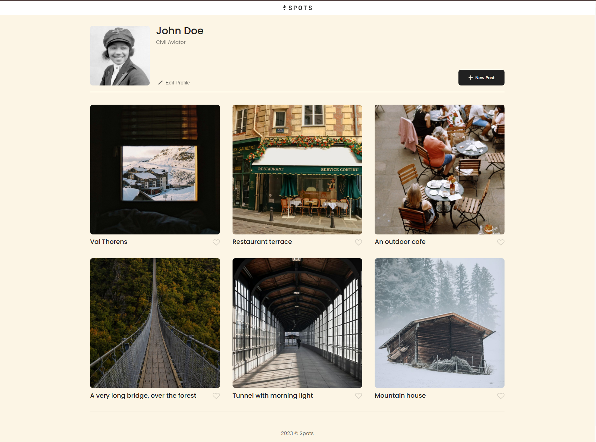
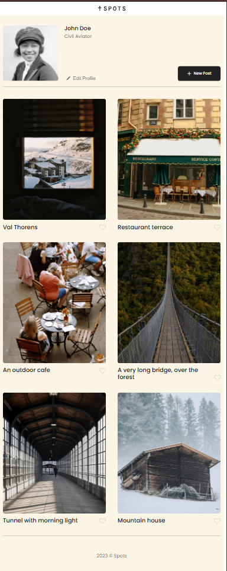
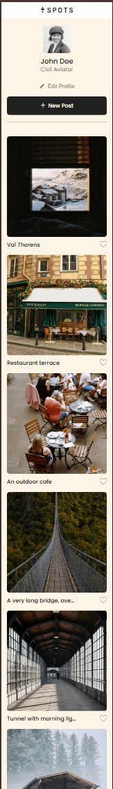

# Project 3: Spots

This project is a social media app called Spots. the main purpose of this project is to practice responsive web design utilizing both HTML and CSS so that the app both functions and looks great on all standard resolutions.

this project was done exclusively using HTML and CSS (though it was a collaberation project through figma)

in the images above you can see the sites responsive design and the changes it makes at different resolutions, you can also view the site yourself using the link below

https://chimichimi123.github.io/se_project_spots/

for future improvements I plan to add accounts with a login and password hashing, a backend so that the site can be interacted with and SQLAlchemy to store data such as account information and users liked posts or their own posts.
